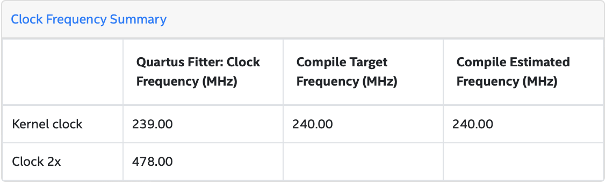

# acorn
Accelerating Acorn: A Lightweight Authenticated Cipher

## Overview

After implementing `ascon` --- a fast, lightweight cryptographic suite, implementing authenticated encryption ( read AEAD ) & cryptographically secure hashing, I decided to take up another winner ( in lightweight application category ) of CAESER AEAD competition --- `acorn` : a lightweight authenticated cipher suite.

> Read more about AEAD [here](https://en.wikipedia.org/wiki/Authenticated_encryption)

> Read more about CAESER competition [here](https://competitions.cr.yp.to/caesar-submissions.html)

> Read Acorn128 v3 specification [here](https://competitions.cr.yp.to/round3/acornv3.pdf), that's what is implemented here ⭐

> If interested in Ascon, see my work [here](https://github.com/itzmeanjan/ascon)

Acorn128 is a lightweight authenticated cipher which implements following two functions

- Authenticated encryption
- Verified decryption

Simply speaking, given a plain text byte array, which is of importance ( imagine it carries some data which is not supposed to be read by everyone ) & some associated data bytes ( which can be public, doesn't carry something to be kept secret, _think of data packet header_ ), authenticated encryption procedure generates equal number of encrypted bytes ( i.e. `len(enc) == len(text)` ) and 128 -bit authenticated tag ( think of it as MAC, see [here](https://en.wikipedia.org/wiki/Message_authentication_code) ). This procedure requires two more inputs

- 128 -bit secret key
- 128 -bit public message nonce **( don't use same nonce twice with same secret key )**

After that encrypted text can be decrypted by another party who has access to following pieces of information

- 128 -bit secret key
- 128 -bit public message nonce
- 128 -bit authentication tag ( computed 👆 )
- Encrypted bytes ( computed 👆 )
- Associated data bytes

Verified decryption procedure should generate two pieces of outputs

- Decrypted data bytes ( `len(dec) == len(enc)` )
- Boolean flag denoting successful verification

After that boolean flag should be tested for truthfulness, if it doesn't pass that test, decrypted data bytes should not be consumed !

If any of authentication tag/ encrypted bytes/ associated data bytes are mutated ( even a single bit flipped ), verified decryption process should fail.

Here I keep a C++ header-only library, implementing **Acorn128 v3**, which can be compiled down to CPU/ GPGPU ( using SYCL kernels ) executable code. Other than that single work-item SYCL kernels ( read SYCL `single_task` ) which can be used for synthesizing Acorn-128 FPGA h/w image, are also made available, accompanied with emulated testing ( to check functional correctness ), FPGA h/w benchmark & example usage code. Single work-item Acorn128 encrypt kernel takes following as input

- N -many independent, non-overlapping, equal-length plain text byteslices
- N -many independent, non-overlapping, equal-length associated data byteslices
- N -many independent, non-overlapping secret keys ( each secret key is of 128 -bit )
- N -many independent, non-overlapping public message nonces ( each nonce is of 128 -bit )

Encrypt produces following in result

- N -many independent, non-overlapping, equal-length encrypted byteslices
- N -many independent, non-overlapping authentication tags ( each tag is of 128 -bit )

Single work-item FPGA offloadable Acorn128 decrypt kernel takes following as input

- N -many independent, non-overlapping, equal-length plain text byteslices
- N -many independent, non-overlapping, equal-length associated data byteslices
- N -many independent, non-overlapping secret keys ( each secret key is of 128 -bit )
- N -many independent, non-overlapping public message nonces ( each nonce is of 128 -bit )
- N -many independent, non-overlapping authentication tags ( each tag is of 128 -bit )

Output computed by decrypt kernel looks like

- N -many independent, non-overlapping, equal-length decrypted byteslices
- N -many independent, non-overlapping verification flag ( each value is boolean )

> Read more about SYCL [here](https://www.khronos.org/registry/SYCL)

> Before consuming each of decrypted byteslices, make sure that respective verification flag is **true**, otherwise something is off !

## Prerequisites

- Make sure you've installed `g++`/ `clang++`/ `dpcpp`; I prefer `dpcpp`, find more [here](https://www.intel.com/content/www/us/en/developer/tools/oneapi/dpc-compiler.html)

> If you happen to be using something other than `dpcpp`, consider updating Makefile.

> If you're interested in synthesizing FPGA h/w image, you must have `dpcpp` along with supported FPGA h/w such as Intel Arria 10 or Intel Stratix 10. I prefer using Intel Devcloud; find more about FPGA synthesis/ execution on Intel Devcloud [here](https://github.com/intel/FPGA-Devcloud/tree/9a7370d)

```bash
$ dpcpp --version

Intel(R) oneAPI DPC++/C++ Compiler 2022.0.0 (2022.0.0.20211123)
Target: x86_64-unknown-linux-gnu
Thread model: posix
InstalledDir: /opt/intel/oneapi/compiler/2022.0.2/linux/bin-llvm
```

or

```bash
$ g++ --version

g++ (Ubuntu 10.3.0-1ubuntu1~20.04) 10.3.0
```

- You'll need system development utilities like `make`, `cmake`

```bash
$ make --version

GNU Make 4.2.1
```

```bash
$ cmake --version

cmake version 3.16.3
```

- For benchmarking Acorn128 implementation on CPU, you must have `google-benchmark` globally installed; see [here](https://github.com/google/benchmark/tree/60b16f1#installation)

- Make sure you've C++ standard library, implementing `C++20` specification, installed

## Testing

For testing functional correctness of Acorn128 cipher suite on CPU, run

```bash
make
```

This will run two kinds of tests

- Test that everything works as expected in ideal scenario
- Test that if any of followings are mutated ( even a single bit flipped ), verified decryption certainly fails
  - Associated data bytes
  - Encrypted data bytes
  - 128 -bit authentication tag
  - 128 -bit public message nonce
  - 128 -bit secret key

To be sure that sythesized FPGA h/w image from Acorn128 encrypt/ decrypt kernels behave as they should, emulate FPGA design using

```bash
make fpga_emu_test
```

## Benchmarking

For benchmarking authenticated encryption & verified decryption of Acorn128 cipher suite, run

> `google-benchmark` header files, source files & library must be globally installed !

```bash
make benchmark
```

```bash
2022-04-13T13:30:10+00:00
Running ./bench/a.out
Run on (4 X 2300.14 MHz CPU s)
CPU Caches:
  L1 Data 32 KiB (x2)
  L1 Instruction 32 KiB (x2)
  L2 Unified 256 KiB (x2)
  L3 Unified 46080 KiB (x1)
Load Average: 0.16, 0.15, 0.10
----------------------------------------------------------------------------------
Benchmark                        Time             CPU   Iterations UserCounters...
----------------------------------------------------------------------------------
acorn_encrypt_64B_32B         1593 ns         1593 ns       437893 bytes_per_second=57.4812M/s items_per_second=627.848k/s
acorn_encrypt_128B_32B        1810 ns         1810 ns       391869 bytes_per_second=84.3073M/s items_per_second=552.516k/s
acorn_encrypt_256B_32B        2178 ns         2178 ns       321253 bytes_per_second=126.09M/s items_per_second=459.08k/s
acorn_encrypt_512B_32B        3075 ns         3075 ns       235572 bytes_per_second=168.713M/s items_per_second=325.199k/s
acorn_encrypt_1024B_32B       4547 ns         4547 ns       153358 bytes_per_second=221.504M/s items_per_second=219.947k/s
acorn_encrypt_2048B_32B       7704 ns         7704 ns        91038 bytes_per_second=257.49M/s items_per_second=129.807k/s
acorn_encrypt_4096B_32B      13994 ns        13993 ns        50042 bytes_per_second=281.337M/s items_per_second=71.464k/s
acorn_decrypt_64B_32B         1601 ns         1601 ns       436588 bytes_per_second=57.1972M/s items_per_second=624.746k/s
acorn_decrypt_128B_32B        1811 ns         1811 ns       386671 bytes_per_second=84.2784M/s items_per_second=552.327k/s
acorn_decrypt_256B_32B        2238 ns         2238 ns       314230 bytes_per_second=122.705M/s items_per_second=446.755k/s
acorn_decrypt_512B_32B        3073 ns         3073 ns       228023 bytes_per_second=168.812M/s items_per_second=325.391k/s
acorn_decrypt_1024B_32B       4744 ns         4744 ns       147653 bytes_per_second=212.276M/s items_per_second=210.783k/s
acorn_decrypt_2048B_32B       8085 ns         8085 ns        86586 bytes_per_second=245.355M/s items_per_second=123.689k/s
acorn_decrypt_4096B_32B      14770 ns        14770 ns        47390 bytes_per_second=266.536M/s items_per_second=67.7043k/s
```

> In above console output, `acorn_{encrypt|decrypt}_X_Y` denotes for testing encrypt/ decrypt routine of Acorn128 cipher suite plain text/ cipher text length is X -bytes while associated data length is Y -bytes. You'll notice Y = 32 -bytes always, while X is varied !

For benchmarking Acorn128 cipher suite implementation on FPGA h/w, see [here](./results/fpga.md)

## Usage

`acorn` is a header-only C++ library, using it is as easy as including header file `include/acorn.hpp` in your program & adding `./include` directory to your `INCLUDE_PATH` during compilation.

- **A**uthenticated **E**ncryption with **A**ssociated **D**ata related routines that you'll be generally interested in, are kept in `acorn::` namespace.
- FPGA synthesizable Acorn-128 AEAD kernels are kept in `acorn_fpga::` namespace, whose implementation is available in `include/acorn_fpga.hpp`
- Also see `include/utils.hpp`, if that helps you in anyways.

See full example of using

- Acorn128 API [here](https://github.com/itzmeanjan/acorn/blob/10f524a/example/acorn128.cpp)
- Acorn128 FPGA Kernels [here](https://github.com/itzmeanjan/acorn/blob/b622943/example/acorn128_fpga.cpp)

## FPGA Optimization Report

One can use `dpcpp` compiler along with Intel oneAPI basekit for generating FPGA optimization reports based on early linked FPGA image. Issue following command for doing so

> Find more about Intel oneAPI basekit [here](https://www.intel.com/content/www/us/en/developer/tools/oneapi/base-toolkit.html#gs.xs0wio)

```bash
make fpga_opt_test
```

These estimates are helpful during development, as it allows one to get feedback on FPGA design without waiting for lengthy FPGA h/w synthesis phase.

Note, it doesn't produce any executable binary, instead render `test/reports/report.html` to view FPGA optimization report. 

## FPGA Design

After going through a lengthy ( ~02:30 hours ) FPGA h/w synthesis phase, while targeting Intel Arria 10 board on Intel Devcloud, I obtained following results in optimization report.




